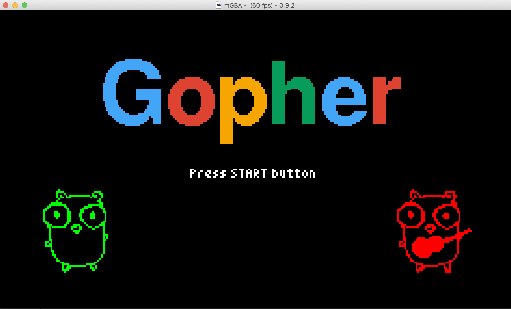

# go-gopher-gba

[](https://goreportcard.com/report/github.com/scraly/learning-go-by-examples)

This repo contains a simple game (yes, very very very simple game) for Game Boy Advance (GBA) in Go, with a basic code organization.

We use:
* [TinyGo](https://tinygo.org/)
* [TinyFont](https://github.com/tinygo-org/tinyfont)
* [TinyDraw](https://github.com/tinygo-org/tinydraw)
* [Gopher font](http://2ttf.com/HCQ3PvcaQ4U) (thanks [@rakyll](https://twitter.com/rakyll) <3)

Please read the [Learning Go by examples: part 5 - xxx](https://dev.to/aurelievache/) article in order to know more about this Git repository.

## General

This simple app/game run on Game Boy Advance portable console and:
* display a screen with "Gopher" text and "Press START button"
* display two gophers
* When you press START button: your Gopher player just appear
* With multi directionnal arrows you can move your Gopher at left, right, top or bottom
* When you press A button: your Gopher jump :-D 
* When you press SELECT button, you go back to "Start" screen

## Pre-requisites

Install Go in 1.16 version minimum.

Install [TinyGo](https://tinygo.org/getting-started/install/).

Install [mGBA](https://tinygo.org/getting-started/install/macos/) emulator.

## Run the app (during development)

```
$ tinygo run -target=gameboy-advance gopher.go
tinygo:ld.lld: warning: lld uses blx instruction, no object with architecture supporting feature detected
```

## Build the app

`$ tinygo build -size short -o bin/gopher.elf -target=gameboy-advance gopher.go; mv bin/gopher.elf bin/gopher.gba`

or

`$ task build`

## Test the app/game

Let's run our app on mGBA emulator:

`$ mgba bin/gopher.gba`



### mGBA Controls

Controls are configurable in the **settings** menu of **mGBA**. Many game controllers should be automatically mapped by default. 
The default keyboard controls are as follows:

```
A: X
B: Z
L: A
R: S
Start: Enter
Select: Backspace
```